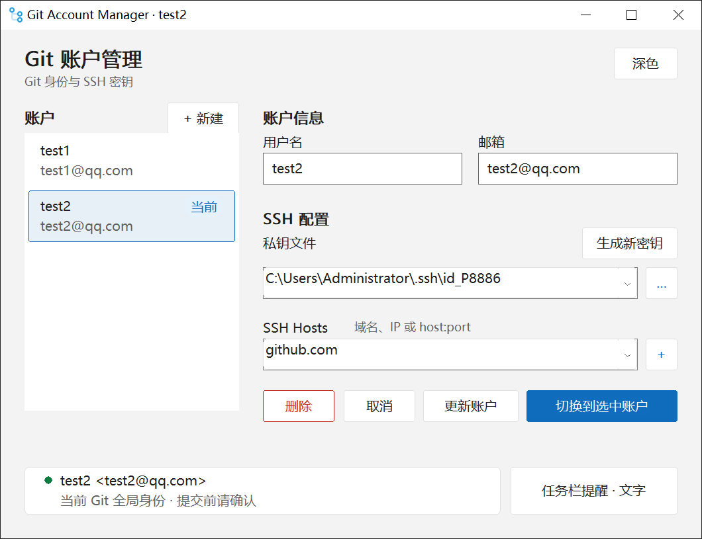
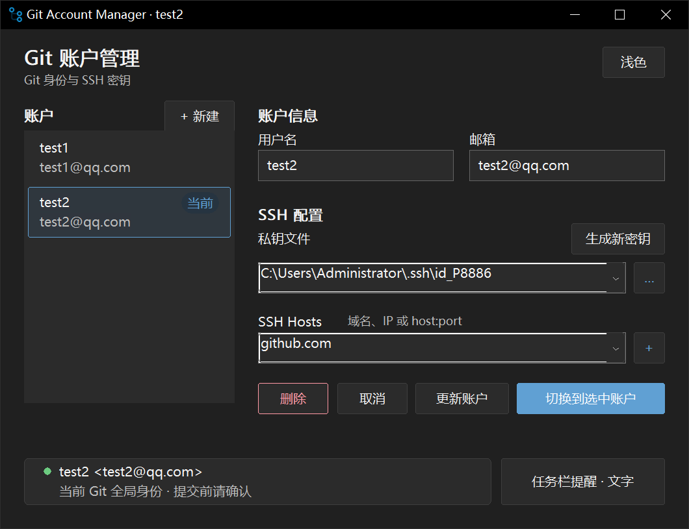
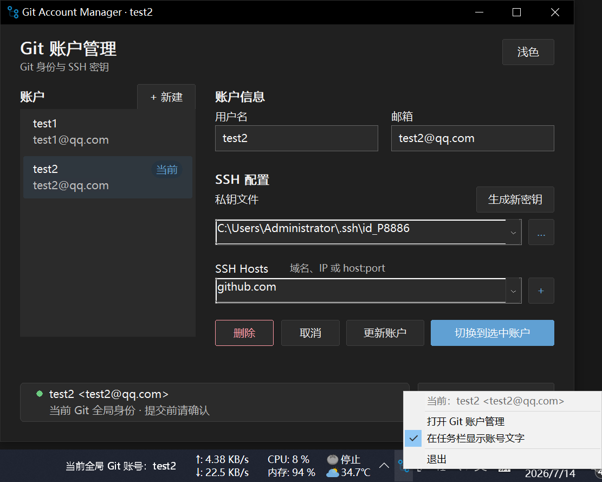

# Git Account Manager

一个纯 Win32 C 编写的轻量 Git 多账户切换工具。无需安装运行时，发布物只有一个 `GitAccountManager.exe`。

## 界面预览

<p align="center">
  
  
</p>

任务栏身份文字支持左键打开主界面，右键使用与托盘图标相同的菜单：



## 功能

- 保存、编辑和删除最多 50 个 Git 账户。
- 一次切换全局 `user.name`、`user.email` 与对应的 SSH 配置。
- 扫描 `~/.ssh` 中真实可读的 OpenSSH / PEM 私钥，过滤公钥和普通文件。
- 生成 Ed25519 或 RSA 密钥，并把公钥复制到剪贴板。
- 可将一个账户的一把 SSH 私钥绑定到最多 10 个 Git 平台或服务器，支持：
  - 域名或 IPv4，例如 `github.com`
  - 非标准端口，例如 `git.example.com:2222`
  - IPv6，例如 `[2001:db8::1]:2222`
- 浅色/深色现代界面，主题设置自动保存。
- 可开启与程序图标一致的账户托盘图标：左键恢复主窗口，悬停显示完整用户名与邮箱，右键菜单可切换任务栏白字或仅保留图标。
- 可选在 Windows 任务栏内常驻白色身份文字：`当前全局 Git 账号：用户名`；左键打开主界面，右键使用与托盘图标相同的菜单。

## SSH 私钥与 Host

SSH Host 用来指定一把私钥要应用到哪些 Git 平台或服务器。同一个账户可以只保存一把私钥，再添加多个 Host，例如 `github.com`、`gitlab.com` 和自建 Git 服务；切换账户时，这些 Host 会统一使用该账户的私钥。

Host 是可选项。不填写 Host 时，程序仍会保存私钥路径并正常切换 Git 全局用户名和邮箱，但不会把该私钥绑定到任何服务器。适用于使用 HTTPS、暂时不需要 SSH，或者自行维护 `~/.ssh/config` 的情况。

## SSH 配置安全策略

程序只维护 `~/.ssh/config` 中带以下边界标记的区域：

```ssh
# >>> Git Account Manager >>>
# 此区域由 Git Account Manager 自动维护，请在区域外编辑自定义配置。
Host github.com
    HostName github.com
    User git
    IdentityFile "C:/Users/you/.ssh/id_github"
    IdentitiesOnly yes
# <<< Git Account Manager <<<
```

切换账户时只替换这个区域，区域外的公司 Host、跳板机、代理和其它自定义配置会原样保留。旧版本生成的 `# Git Account Manager - ...` 配置块会在首次切换时迁移；不再需要 `# do not delete` 标记。

Git 与 SSH 配置先完整校验，再通过临时文件原子替换。任一步写入失败时，已经写入的 Git 配置会回滚，界面也不会把账户标记为切换成功。

## 使用

1. 填写用户名和邮箱。
2. 从下拉框选择私钥，或点击“生成新密钥”。
3. 按需填写使用该私钥的 SSH Host；同一把私钥可添加多个平台，不需要程序管理 SSH 绑定时可以留空。
4. 保存账户。
5. 从左侧选择账户，点击“切换到选中账户”；编辑已有账户并点击“更新账户”时会立即应用改动。
6. 需要常驻提醒时，开启“任务栏提醒”。右键托盘图标可勾选“在任务栏显示账号文字”；取消勾选后只保留图标与完整身份悬停提示。

开启任务栏提醒后，点击主窗口右上角关闭只会隐藏窗口，后台提醒继续运行；再次启动程序或左键点击托盘图标会恢复窗口。需要彻底结束进程时，使用托盘右键菜单中的“退出”。

任务栏身份文字不接收焦点；左键可恢复主窗口，右键可打开与托盘图标相同的菜单。Explorer 重启或显示设置改变后会自动重新定位，并会避开紧邻通知区域的已有工具栏。它显示的是 **Git 全局身份**，如果某个仓库在 `.git/config` 中设置了本地 `user.name` 或 `user.email`，本地设置仍会覆盖全局身份。

## 配置位置

| 内容 | 路径 |
|---|---|
| 账户与界面设置 | `%APPDATA%\git-account-manager-c\accounts.json` |
| Git 全局身份 | `%USERPROFILE%\.gitconfig` |
| 程序管理的 SSH Host | `%USERPROFILE%\.ssh\config` 中的标记区域 |

## 构建与测试

要求 Windows 10/11、Git/OpenSSH，以及 MinGW-w64 GCC。项目会优先使用 `PATH` 中的 `gcc` 和 `windres`。

```bat
test.bat
build.bat
```

`test.bat` 在临时目录运行隔离测试，不读取或修改真实的 `.gitconfig`、`.ssh/config` 和账户配置。测试覆盖 JSON 往返、大型 Git 配置保全、SSH 自定义块保全、Host/端口校验、外部及中文密钥路径、密钥生成，以及 Git/SSH 联合切换失败回滚。

## 主要文件

| 文件 | 职责 |
|---|---|
| `main.c` | 主窗口、账户交互、主题与切换流程 |
| `logic.c/.h` | 配置解析、Git/SSH 原子写入、校验与密钥生成 |
| `ui_draw.c/.h` | 现代配色、按钮、账户列表与身份卡绘制 |
| `ui_gen_key.c/.h` | SSH 密钥生成窗口与公钥复制 |
| `ui_taskbar.c/.h` | Windows 任务栏内的全局身份文字 |
| `ui_tray.c/.h` | 托盘图标、完整身份提示与右键菜单 |
| `tests/test_logic.c` | 隔离逻辑与回滚测试 |
